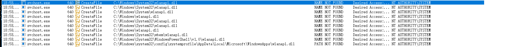
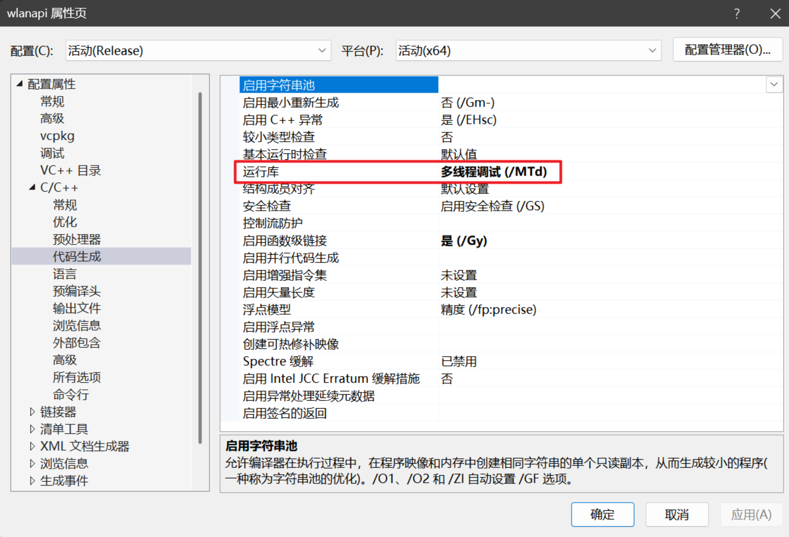

# NetManTrigger

**NetManTrigger** 是一个针对 Windows Server 平台的本地提权（Local Privilege Escalation, LPE）概念验证工具（PoC）。

它利用了 **Network Connections (NetMan)** 服务中的 DLL 劫持漏洞，通过放置恶意的 `wlanapi.dll`，将权限从本地用户/管理员提升至 **NT AUTHORITY\SYSTEM**。

## 📖 简介 (Introduction)

在 Windows Server 操作系统中，默认未安装“无线局域网服务”（Wireless LAN Service），导致系统目录 `C:\Windows\System32\` 下缺失 `wlanapi.dll` 文件。

然而，以 SYSTEM 权限运行的 NetMan 服务在启动或枚举网卡时，依然会尝试加载该 DLL。由于 System32 中不存在该文件，Windows 加载器（Image Loader）会按照 DLL 搜索顺序，在系统环境变量 `%PATH%` 指定的目录中查找该文件。

如果攻击者对 `%PATH%` 中的某个目录拥有**写入权限**，即可通过植入恶意的 DLL 实现代码执行并提权。

## 🎯 支持的系统 (Target Systems)

本漏洞主要影响 **Windows Server** 版本，因为客户端版本（Windows 10/11）默认存在该 DLL，无法触发搜索顺序劫持。

经测试支持的版本：
- Windows Server 2008 R2
- Windows Server 2012 / 2012 R2
- Windows Server 2016
- Windows Server 2019

> **注意**：Windows 10 / 11 等客户端版本不受影响（除非用户手动卸载了无线 LAN 功能）。

## 🚀 利用条件 (Prerequisites)

为了成功利用此漏洞，必须满足以下条件：

1.  **目标系统为 Windows Server**（System32 下无 `wlanapi.dll`）。
2.  **PATH 写入权限**：当前用户必须对系统 `%PATH%` 环境变量中的至少一个目录拥有写入权限（例如：权限配置不当）。

注意：`%PATH%` 只代表下面这些默认的环境变量：

而并非用户添加的系统环境变量或者用户变量，这些用户添加的 `PATH` 都不会被用来寻找DLL文件。

## 🛠️ 使用方法 (Usage)

### 1. 编译 (Compile)

确保：配置属性-C/C++-代码生成-运行库，设置如下：

然后使用 Visual Studio 编译项目生成的 DLL 和 利用软件。

### 2. 执行攻击 (Exploit)
1. 将编译好的 `wlanapi.dll` 复制到目标可写目录中。（一般`C:\Windows\System32\wlanapi.dll`）
2. 执行 `NetManTrigger.exe` 触发 NetMan 服务加载 DLL。可以通过重启服务（如果权限允许）或等待系统自动触发（如网络状态改变）。
3. 恶意代码将以 SYSTEM 权限执行。

## ⚠️ 免责声明 (Disclaimer)

本项目仅用于安全研究和教育目的。请勿在未经授权的系统上使用。作者对因使用本工具造成的任何直接或间接损害概不负责。

**This tool is for educational purposes and security research only. Do not use it on systems you do not own or have explicit permission to test.**

## 🔗 参考 (References)

本项目的核心原理基于 ITm4n 的研究文章：

* **Windows Server NetMan Service DLL Hijacking** by @itm4n  
  [https://itm4n.github.io/windows-server-netman-dll-hijacking/](https://itm4n.github.io/windows-server-netman-dll-hijacking/)